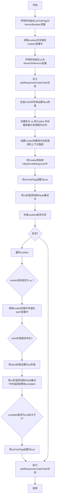

# 代码逻辑流程图

```mermaid
graph TD;
    A[开始] --> B[声明并初始化uvFirstFlag为AtomicBoolean变量]
    B --> C[获取cookies并存储在cookies变量中]
    C --> D[声明并初始化uv为AtomicReference变量]
    D --> E[定义addResponseCookieTask任务]
    E --> F[生成UUID并将其设置为uv的值]
    F --> G[创建名为 uv 的Cookie 并设置其最大有效期为30天]
    G --> H[设置Cookie的路径为当前请求的上下文路径]
    H --> I[将Cookie添加到HttpServletResponse中]
    I --> J[将uvFirstFlag设置为true]
    J --> K[将uv的值添加到Redis集合中]
    K --> L[检查cookies是否为空]
    L --> M{非空?}
    M --> N[遍历cookies]
    N --> O{cookie名称是否为 uv ?}
    O --> P[获取cookie的值并存储在each变量中]
    P --> Q{each的值是否存在?}
    Q --> R[将each的值设置为uv的值]
    R --> S[将uv的值添加到Redis集合中并返回结果给uvAdded]
    S --> T{uvAdded是否为null且大于0?}
    T --> U[将uvFirstFlag设置为true]
    U --> V[执行addResponseCookieTask任务]
    M --> V
    V --> W[结束]
```